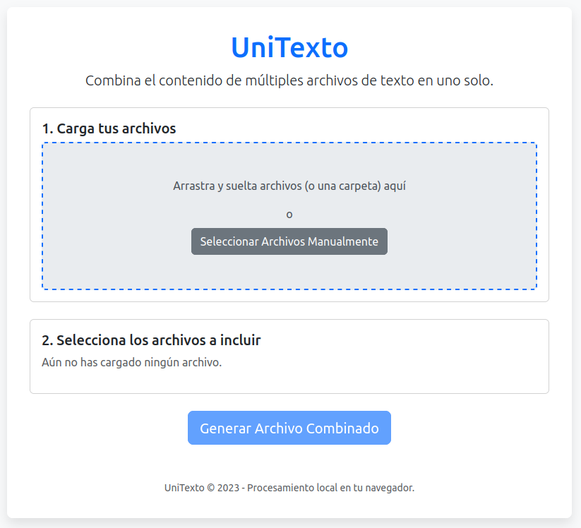

# Text-File-Combiner 🗂️

Una herramienta sencilla y eficiente para combinar el contenido de múltiples archivos de texto (incluyendo archivos dentro de carpetas y subcarpetas) en un único archivo `.txt`, directamente en tu navegador.

▶️ **Prueba la herramienta aquí:** [https://Soyunomas.github.io/Text-File-Combiner/](https://Soyunomas.github.io/Text-File-Combiner/unirtexto.html) 

### Vista Previa

## ¿Por Qué Usar Esta Herramienta? 🤔

Esta utilidad resuelve la necesidad común de consolidar texto desde diversas fuentes (código fuente, notas, logs, etc.) en un solo archivo manejable. Es especialmente útil para:

*   **Preparar datos para modelos de IA 🧠:** Muchas plataformas de IA tienen restricciones de subida en tipos de archivo o límite de archivos. Esta herramienta facilita la combinación de todo tu texto en un formato compatible.
*   **Crear compilaciones o resúmenes 📚:** Unifica rápidamente notas dispersas, artículos guardados o fragmentos de código para una revisión más sencilla.
*   **Procesamiento Local y Privado 🔒:** Toda la lectura y combinación de archivos ocurre **directamente en tu navegador**. Tus archivos **nunca se suben** a ningún servidor externo, garantizando la privacidad y seguridad de tus datos.

## Características Principales ✨

*   **Combinación Múltiple:** Selecciona archivos individuales o arrastra y suelta varios a la vez.
*   **Soporte Recursivo de Carpetas:** Simplemente arrastra una carpeta completa para incluir el contenido de todos los archivos de texto válidos que contenga (y en sus subcarpetas).
*   **Selección de Archivos ✅:** Control total sobre qué archivos cargados se incluirán en el archivo combinado final.
*   **Interfaz "Arrastrar y Soltar" (Drag & Drop) 🖱️:** Carga de archivos fácil e intuitiva.
*   **Procesamiento en el Cliente 💻:** Rápido, seguro y funciona sin conexión una vez que la página se ha cargado inicialmente.
*   **Marcadores de Origen 🏷️:** El archivo resultante incluye cabeceras (`# Nombre [archivo] #`) y pies (`# Fin Nombre [archivo] #`) para identificar fácilmente de dónde proviene cada sección de texto.
*   **Interfaz Limpia:** Diseño responsivo y agradable gracias a Bootstrap 5.

## Cómo Utilizar 🚀

1.  **Abrir:** La forma más sencilla es usar el enlace a la [Demo en Vivo](https://Soyunomas.github.io/Text-File-Combiner/unirtexto.html).
    *   Alternativamente, descarga el archivo `unirtexto.html` y ábrelo con tu navegador web preferido (Chrome, Firefox, Edge, etc.).
2.  **Cargar Archivos:**
    *   Arrastra y suelta los archivos o carpetas que quieras procesar directamente sobre la "zona de carga".
    *   Alternativamente, haz clic en el botón "Seleccionar Archivos Manualmente".
3.  **Seleccionar:** Revisa la lista de archivos que aparecen. Por defecto, todos están seleccionados. Desmarca las casillas de aquellos archivos que *no* quieras incluir en el resultado final.
4.  **Generar:** Haz clic en el botón "Generar Archivo Combinado". El botón solo estará activo si hay al menos un archivo seleccionado.
5.  **Descargar 💾:** El navegador iniciará automáticamente la descarga del archivo combinado, llamado `UniTexto_resultado.txt`.

## Tecnologías Utilizadas 🛠️

*   HTML5
*   CSS3 (con Bootstrap 5)
*   JavaScript Nativo (Vanilla JS - ES6+)

## Licencia 📄

Este proyecto es de código abierto y se distribuye bajo la [Licencia MIT](LICENSE).

---
*Creado por Soyunomas*
